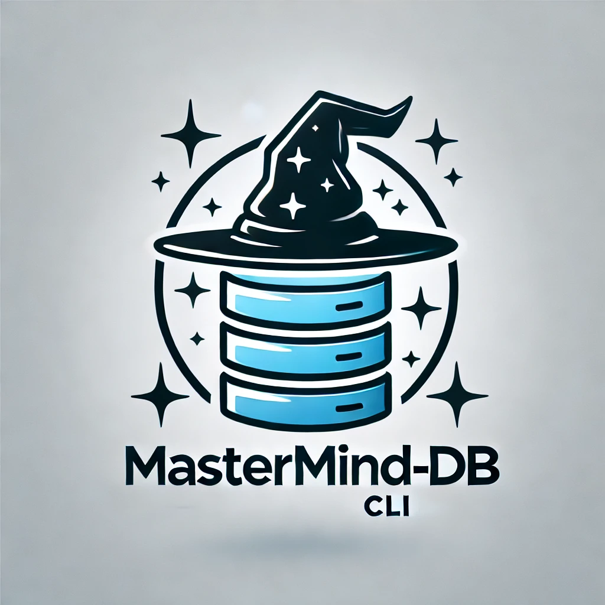

  <div align="center">
     
  </div>
 

<h1 align="center">MasterMind-DB CLI </h1>
<div align="center"></div>
<br/>

**MasterMind-DB** is a versatile and extensible CLI tool designed for managing databases and ORM-based projects. It supports multiple ORMs, including Sequelize, and integrates seamlessly with Docker for containerized database management.

---

## **Features**

- Generate database structures, models, migrations, and seeders.
- Supports multiple ORMs (Sequelize, Prisma, TypeORM).
- Docker integration for starting and stopping containers.
- Dynamic configuration management stored in `.mastermindrc`.
- Interactive CLI with prompts and spinners for a smooth user experience.
- Handles volumes and services directly in `docker-compose.yml`.
- Allows custom configuration and project settings.

---

## **Prerequisites**

1. **Node.js** (v16 or later)

   ```bash
   sudo apt update
   sudo apt install nodejs npm
   node -v
   npm -v
   ```

2. **Docker** (Latest Version)

   ```bash
   sudo apt update
   sudo apt install docker.io
   sudo systemctl start docker
   sudo systemctl enable docker
   docker --version
   ```

3. **Docker Compose** (V2 recommended)
   ```bash
   sudo apt install docker-compose
   docker-compose --version
   ```

---

## **Installation**

### **Global Installation**

```bash
npm install -g mastermind-db
```

### **Project-Specific Installation**

```bash
npm install mastermind-db
```

---

## **Commands and Usage**

### **1. Initialize a Project Configuration**

```bash
mastermind-db init
```

- Prompts for:
  - Root directory for projects.
  - Service name.
  - ORM type.

### **2. Create a New Service**

```bash
mastermind-db create
```

- Guides through creating a database service.
- Asks for database type (MySQL/PostgreSQL).
- Prompts for ORM (Sequelize/Prisma/TypeORM).
- Optionally generates a Docker Compose setup.
- Optionally starts Docker containers if available.

### **3. Manage Existing Service**

```bash
mastermind-db manage
```

- Allows updating configurations or generating files (models, migrations, seeders) for existing services.

### **4. Delete a Service**

```bash
mastermind-db delete
```

- Selects and deletes a service.
- Removes folders, updates `.mastermindrc`, and edits `docker-compose.yml`.
- Stops and removes running Docker containers and volumes.

### **5. Configuration Settings**

```bash
mastermind-db config
```

- Allows managing root directories and ORM configurations.

---

## **Docker Integration**

- Automatically adds services to `docker-compose.yml`.
- Handles starting and stopping Docker containers.
- Ensures volume mappings for persistent storage.

### **Docker Commands**

#### Check Docker Dependencies

```bash
mastermind-db check-docker
```

- Verifies Docker and Docker Compose installation.

#### Start Docker Containers

```bash
mastermind-db start-docker <service-name>
```

#### Stop and Remove Docker Containers

```bash
mastermind-db delete
```

- Deletes services, containers, and volumes.

---

## **Example Workflow**

### 1. Initialize Project

```bash
mastermind-db init
```

### 2. Create a Service

```bash
mastermind-db create
```

Choose:

- Database: MySQL
- ORM: Sequelize
- Generate Docker Compose: Yes
- Start Docker Container: Yes

### 3. Generate Files

```bash
mastermind-db manage
```

- Generate models, migrations, and seeders interactively.

### 4. Delete a Service

```bash
mastermind-db delete
```

- Select service to delete.
- Deletes files, config, and Docker containers/volumes.

---

## **Configuration File** (`.mastermindrc`)

Example:

```json
{
  "rootDir": "./src",
  "services": {
    "auth-service": {
      "orm": "Sequelize",
      "migrationsDir": "./src/auth-service/sequelize/migrations",
      "modelsDir": "./src/auth-service/sequelize/models",
      "seedersDir": "./src/auth-service/sequelize/seeders"
    }
  }
}
```

---

## **Troubleshooting**

1. **Docker Not Installed:**

   - Install Docker and Docker Compose as mentioned in prerequisites.

2. **Permission Denied for Docker Commands:**

   - Add the user to the `docker` group.

   ```bash
   sudo usermod -aG docker $USER
   newgrp docker
   ```

3. **Configuration File Issues:**
   - Run `mastermind-db config` to update settings.

---

## **Contributing**

Contributions are welcome! Feel free to fork this repository and submit pull requests.

---

## **License**

This project is licensed under the [MIT License](LICENSE).

---

## **Contact**

For any questions or feedback, please reach out to the repository maintainer.
